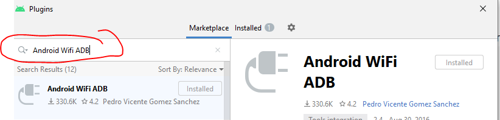
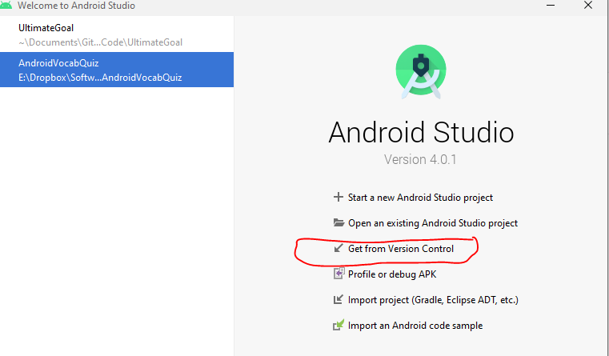
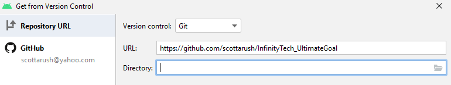
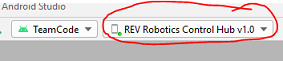

# Introduction
This is the TeamCode module for the FTC InfinityTech #13684 robotics team.  This readme documents the InfinityTech team software tool setup and architecture for the 2020-2021 Ultimate goal season here.

# Installing Android Studio
InfinityTech uses Android Studio for all development.  Here are the basic instructions for installing Android Studio and setting it up:
1.  Download Android Studio.  Unfortunately the latest version has broken the plugin we use for wireless development over Wifi, so you'll need to download the older 4.0.1 version from one of the following links:  
Windows: [Android 4.0.1 for Windows](https://redirector.gvt1.com/edgedl/android/studio/install/4.0.1.0/android-studio-ide-193.6626763-windows.exe)  
Mac: [Android 4.0.1 for Mac](https://redirector.gvt1.com/edgedl/android/studio/install/4.0.1.0/android-studio-ide-193.6626763-mac.dmg)
2.  Install Android Studio on either a Windows PC or a Mac.  The Chrome version can't be installed on your school Chromebooks.
3.  Start Android Studio and select "Configure->Plugins" (at the bottom of the start page).
4.  Type in "Android Wifi ADB" plugin in the left search box, select it in the list, and hit the "Install" button on the right (note that the plugin is already installed on my computer):
  

## Downloading TeamCode from Github
Once you have installed Android Studio, you will need to "Clone" the TeamCode from Github as follows:
1.  Start Android Studio and select "Get From Version Control"  on the start page:
  
2.  Enter the team repository URL below into the "Get From Version Control" dialog:  https://github.com/scottarush/InfinityTech_UltimateGoal:  For the "Directory:" enter a location on your computer's hard drive to store your copy, such as _C:\Documents\My_UltimateGoal_Code_, but you can enter any directory you want:

3.  Hit the "Clone" button at the bottom and Android Studio should automatically clone the team repository.  Once the download finishes, Android Studio will build the code.  If you have issues, we'll need discuss those at the next robotics meeting. 

### Creating a Github ID
Our InfinityTech_UltimateGoal github repository is public so you can clone it without a github id.  However, if you want to make changes to the code, you'll need one.  If you don't already have an id, then go to https://github.com and hit the "Sign Up" button on the upper right to create your id.
Send an email with your ID to the team software lead so that we can add you to the collaborators list to be able to push code changes.  

## Control and Expansion Hubs
The rev robotics website has a good overview of both the Control and Expansion hubs here:  https://docs.revrobotics.com/rev-control-system/control-system-overview/control-hub-basics.  

### Developing with the Control Hub
Starting with the 2020-2021 Ultimate Goal season, InfinityTech uses Control hubs and, if we need more outputs, an attached Expansion hub.  We don't use an Expansion hub and a "Robot Controller" mobile phone on the robot.  Developing robot code using the Control hub is much much faster.  The basic process is:
1.  Configure the attached hardware on the Control Hub (motors, servos, etc.) using the _Driver Station_ phone using the instructions here:  https://docs.revrobotics.com/rev-control-system/getting-started/control-hub/configuration.  Note that you only need to update the configuration when something changes (or you switch to a new Driver Station phone without the correct robot configuration.
2.  Start Android Studio and open up your UltimateGoal project on your computer.
3.  Turn on power to the Control Hub on the robot
4.  Connect your computer to the Control Hub's Wifi Hotspot.  We named _InfinityTech13684_.  The software lead can give you the password.
5.  Open a Windows or Mac command shell and connect the "Android Debug Bridge", or _adb_, to the robot with the following command:  _c:\adb connect 192.168.43.1_.
This lets Android Studio know about the connected robot (through adb).
6.  Go back into Android Studio.  Within a few seconds or so you should see the robot as a "development target" in the box at the top of the screen:

# Autonomous Mode
InfinityTech has developed a framework for autonomous mode control using state machines, a Kalman Filter, and a guidance controller that implements "Proportional Integral Control" or _PID_ algorithms.  This section provides a brief overview of each of these elements.  The code is in the following two packages:
- org.firstinspires.ftc.teamcode.autonomous
- org.firstinspires.ftc.teamcode.guidance

## State Machine Compiler
InfinityTech uses the open source _State Machine Compiler_ or _SMC_ project hosted on SourceForge here:  http://smc.sourceforge.net/, specifically the Java version.  SMC is an automatic code generator that takes in a description of a state machine and generates Java code.  A _state machine_ or, to use the exact computer science term, a _Finite State Machine_ is a very powerful way to program computers to know what actions to take in response to inputs.  Wikipedia has a very good description of state machines here:  https://en.wikipedia.org/wiki/Finite-state_machine

All of the state machine code is in the `org.firstinspires.ftc.teamcode.autonomous package`.

### SMC Input File
SMC uses a text file with a .sm extension and a specific syntax to describe our state machine.  Here's a snippet from a demo running on our Mecanum wheel drivetrain that executes the following sequence:
1.  Rotate the robot 90 degrees
2.  Drive 24 inches forward
3.  Rotate back 90 degrees
4.  Strafe back 24 inches to the original starting position.

~~~
    Start
        Entry {
            rotateToHeading(90);
        }
    {
        evRotationComplete Drive { }
    }

    Drive
        Entry{
            moveStraight(24d);
         }
    {
        evMoveComplete RotateBack {}
    }

    RotateBack
        Entry{
            rotateToHeading(0);
        }
    {
        evRotationComplete StrafeBack {}
    }
    StrafeBack
        Entry{
            strafe(-24d);
        }
    {
        evMoveComplete Complete {}
    }
   /*
    * Final state
    */
    Complete
        Entry{
            stop();
        }
~~~
SMC has a utility to translate the textual description into a diagram format for documentation.  The above demo sequence looks like this:

The website has detailed documentation the syntax of the _.sm_ input file format.  However, basically you have decide what are the "states" of the sequence you want to create, which in the above example are Start, Drive, RotateBack, StrafeBack, and Complete.  You then have to use "events" to trigger transitions between the states.  For example, the _evRotationComplete_ event is triggered by the `GuidanceController` framework once the robot completes a rotation command.  Similarly, the _evMoveComplete_ event is generated by the `GuidanceController` whenever a straight or strafe movement has completed.

### Running the State Machine Compiler Generator
The SMC generator itself is a Java program that has to be run from the command line, but there is a short batch file in the autonomous folder that allow you to regenerate by right-clicking the gen_autosm.bat file and selecting the "Run Cmd Script" (not shell) in Android Studio.  

### Note on SMC.jar library
The gen_autosm.bat file  points to a _Smc.jar_ file located in the 'TeamCode/lib' directory.  Note that 'Smc.jar' is only used to re-generate the state machine Java code.  Smc.jar isn't used as a library at runtime.  Only  4 base class files are needed at runtime, and these have been copied into the _Teamcode/statemap_ package.

## Navigation in Autonomous Mode
In order for the robot to navigate the playing field during autonomous mode, the robot needs the following two capabilities:
1. The robot must be able to continuosly track its location and the direction it is pointing, known as _position and  _heading_.  
2.  The robot drivetrain must be able to move in response to commands from the autonomous state machine code such as in the example above.

InfinityTech implements these two functions using a _Basic Kalman Filter_ and a _PID_ controller framework called the _Guidance Controller_.  This section describes both of these functions.  The software for both is in the _org.firstinspires.ftc.teamcode.guidance_ package.

### Kalman Filter
InfinityTech has developed a _Basic Kalman Filter_ that reads encoder signals from each wheel motor of the drivetrain and the Gyro signal from the Control Hub's internal  _IMU_ or Inertial Measurement Unit.  Both of these signals are very noisy and can drift significantly as the robot moves around the playing field.  The Kalman Filter is a signal processing software technique that was originally designed for the Apollo program during the NASA moon missions in the 1960s.  

Kalman Filters are now used widely in almost all navigation systems in robots, autonomous vehicles, etc..  InfinityTech's KalmanFilter code is in the org.firstinspires.ftc.teamcode.guidance package, and it allows us to combine measurements from the wheel motor encoders and the IMU to determine the robot's position and heading during autonomous mode.  We then use the estimated position and heading to feed the GuidanceController described below and our State Machine Compiler scripts.

There is a Word doc technical description of our Kalman Filter in the .guidance package if you are interested in the gritty details or want to read further as you continue your engineering studies.

#### EJML Library and Setup Notes
The Kalman Filter equations are computed using a mathematics technique called _Matrix Algebra_.  There are open source software packages that implement these complex routines.  InfinityTech uses the _Efficient Java Matrix Library_ or _ejml_ which has a website here:  [ejml.org website](https://ejml.org/wiki/index.php?title=Main_Page).

The pre-built _ejml_ release from the website won't work with our robot because it was compiled for an Android Java version that is newer than the one supported by the control hub software.  We had to modify the source very slightly from the libejml-0.39 version to get ejml to compile with the older Android K version on the control hub.  The source for the _libejml.jar_ re-compiled library is inside our Github repo for archive purposes, but we don't expect anyone will ever need to touch it or rebuild the library again.  

However, future teams will likely need to set up a new Github fork in Android.  Any time you need to setup a new TeamCode repository, you need to add the following two settings within Android Studio so that it can find and use the re-compiled ejml library:  
1.  Add the following to the TeamCode/build.gradle file if it s not there:
    dependencies{
        implementation files('lib/libejml.jar')
    }

2.  Make sure the source options in the TeamCode/build.common.gradle file has the following:
    compileOptions {
        sourceCompatibility JavaVersion.VERSION_1_8
        targetCompatibility JavaVersion.VERSION_1_8
    }
    The default is VERSION_1_7 which won't work.

### Guidance Controller
